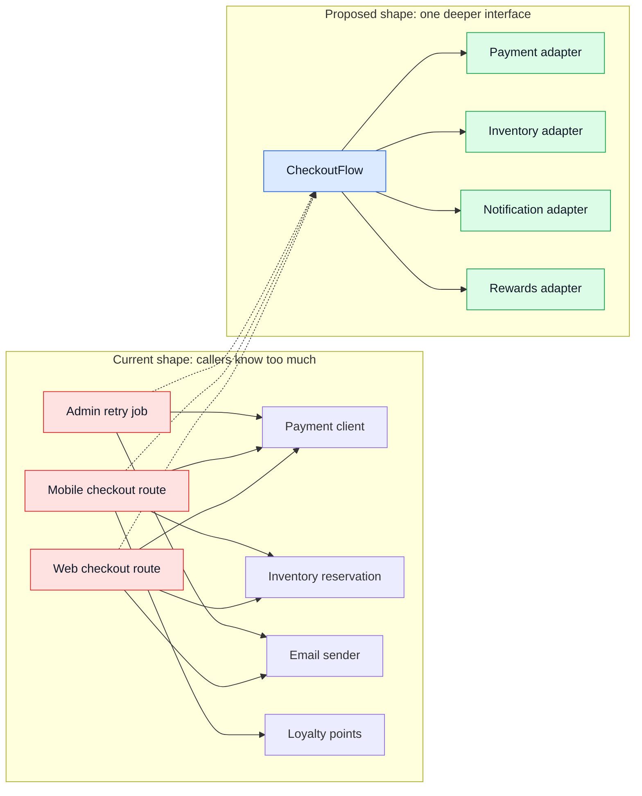

<p align="center">
  
</p>

<h1 align="center">Improve Codebase Health</h1>

<p align="center">
  <strong>Codebase health reviews grounded in classic software engineering books.<br>
  Consistent. Traceable. Safe to act on.</strong>
</p>

<p align="center">
  <a href="#why-now">Why Now</a> •
  <a href="#what-it-looks-like">What It Looks Like</a> •
  <a href="#installation">Installation</a> •
  <a href="#usage">Usage</a> •
  <a href="#how-it-compares">How It Compares</a>
</p>

<p align="center">
  
  
  
  
</p>

---

AI makes code faster to write. It also makes architecture easier to lose touch with.

Improve Codebase Health is a plugin package that helps coding agents review whether a codebase is still safe to change. It looks past syntax, style, and coverage into the problems that compound slowly: vague names, shallow modules, weak seams, dependency drift, brittle tests, and code that future agents can plausibly misunderstand.

Run it anytime: before a PR, after a feature lands, during a refactor, before release, or as a regular codebase stewardship ritual. Weekly cleanup is a good habit, not a product limitation.

Every finding follows:

```text
Symptom -> Source -> Consequence -> Remedy
```

And every recommendation is classified by safety:

```text
Tier 0: report only
Tier 1: auto-safe cleanup
Tier 2: ask before changing
Tier 3: design required
```

The point is simple: surface architecture drift without letting agents casually reshape the system.

## Why Now

AI-assisted engineering changes the failure mode.

The old problem was writing code slowly. The new problem is changing code so quickly that system shape gets blurry. A codebase can pass tests and type checks while becoming harder for humans and agents to modify safely.

This plugin gives agents explicit signals for the pain senior engineers usually feel first:

- this name invites the wrong edit
- this interface leaks too much implementation
- this test gives confidence in the wrong thing
- this helper exists because the original pattern was unclear
- this module is shallow, so every caller carries complexity
- this cleanup is safe, but that architecture change needs design

The goal is not prettier code. The goal is a codebase that keeps explaining itself as it scales.

## The Books

| Book | Author | Helps Detect |
| --- | --- | --- |
| The Mythical Man-Month | Frederick Brooks | accidental complexity, coordination drag |
| Code Complete | Steve McConnell | unclear control flow, weak naming, risky conditionals |
| Refactoring | Martin Fowler | duplication, divergent change, shotgun surgery |
| Clean Architecture | Robert C. Martin | dependency direction, policy/detail leakage |
| The Pragmatic Programmer | Andrew Hunt and David Thomas | hidden coupling, knowledge duplication |
| Domain-Driven Design | Eric Evans | distorted domain language, overloaded concepts |
| A Philosophy of Software Design | John Ousterhout | shallow modules, high cognitive load |
| Software Engineering at Google | Titus Winters, Tom Manshreck, and Hyrum Wright | sustainable change, dependency hygiene |
| Working Effectively with Legacy Code | Michael Feathers | missing test seams, legacy risk |
| xUnit Test Patterns | Gerard Meszaros | brittle tests, fixture bloat |
| The Art of Unit Testing | Roy Osherove | weak assertions, poor isolation |
| How Google Tests Software | James Whittaker, Jason Arbon, and Jeff Carollo | risk-based testing, confidence gaps |

Software engineering principles are timeless. AI-assisted teams need them more, not less, because code volume and change frequency are higher.

## Health Dimensions

| Dimension | Diagnostic Question |
| --- | --- |
| Change Safety | How many unrelated things could break from one change? |
| Agent Navigability | Can an agent find the right files, concepts, and checks quickly? |
| Domain Clarity / Ambiguity | Could names or models cause plausible wrong edits? |
| Type Safety | Do types encode important invariants? |
| Test Confidence | Would tests catch the bugs this area is likely to produce? |
| Module Depth / Architecture | Do modules provide leverage behind coherent interfaces? |
| Dead Code / Duplication / Slop | Is stale weight slowing the system down? |
| Dependency Direction | Do dependencies point in an understandable direction? |

Full guide: [docs/health-dimensions.md](docs/health-dimensions.md).

## Practical Use Cases

| Situation | Recommended Run |
| --- | --- |
| Before opening a PR | `/improve-codebase-health --scope diff --mode audit` |
| After a feature lands | `/improve-codebase-health --scope since --since 5 --mode friday-steward` |
| When a package feels hard to change | `/improve-codebase-health --scope path --path <path> --mode plan-refactor` |
| Before touching legacy code | `/improve-codebase-health --scope path --path <path> --mode audit` |
| When agents keep making wrong edits | Audit agent navigability and ambiguity findings |
| When tests pass but confidence is low | Focus on test confidence and module depth |

You can also talk to your coding agent naturally:

```text
I want to see how we can improve the health of our onboarding feature.
Look for architecture drift, ambiguous names, weak tests, and safe cleanup opportunities.
Do not make risky architecture changes without asking me first.
```

Or:

```text
Can you run Improve Codebase Health on the billing system and tell me what would make it safer for future agents to change?
```

## What It Looks Like

```text
Health Score: 74/100
Scope: current branch diff against origin/main
Mode: audit

[high] [Tier 3] [Module Depth / Architecture]
Checkout orchestration leaks payment, inventory, and email details

Symptom:
Checkout callers must understand payment capture order, inventory reservation rules, and email timing.

Source:
A Philosophy of Software Design by John Ousterhout — shallow modules.
Refactoring by Martin Fowler — divergent change.

Consequence:
A small fulfillment change can break payment or notification behavior.

Remedy:
Design a deeper CheckoutFlow interface that owns orchestration and exposes observable outcomes.

Verification:
Move tests to checkout outcomes. Keep payment, inventory, and email behind adapters.
```

The same finding can include a dependency sketch:



More examples: [docs/gallery.md](docs/gallery.md).

## Installation

### One Prompt Install

Paste this into your coding agent terminal/session:

```text
Install the Improve Codebase Health plugin from https://github.com/Nairon-AI/improve-codebase-health for the current coding agent/repo.

Rules:
- Do not change product code.
- Do not overwrite unrelated agent docs, skills, commands, or config.
- Prefer the agent's native plugin/skill install mechanism.
- If native plugin install is unavailable, install the bundled skill from `skills/improve-codebase-health`.
- If an existing `improve-codebase-health` install exists, replace only that skill/plugin folder.
- Preserve and report any existing repo conventions you detect.

Detect and install in this order:
1. Claude Code: use plugin install if available:
   `/plugin marketplace add Nairon-AI/improve-codebase-health`
   `/plugin install improve-codebase-health@improve-codebase-health-marketplace`
   If slash plugin install cannot run from this context, install repo-local fallback to `.claude/skills/improve-codebase-health` and copy `commands/improve-codebase-health.md` to `.claude/commands/improve-codebase-health.md` if `.claude/commands` exists.
2. Codex: use the native skill/plugin installer if available. Otherwise install to `.agents/skills/improve-codebase-health` for repo-local use, or `~/.codex/skills/improve-codebase-health` for global use if the user asked for global.
3. Cursor / Copilot / generic Agent Skills: install to the repo's existing skill folder if present: `.agents/skills`, `.github/skills`, `.cursor/skills`, or tool-specific equivalent. If none exists, create `.agents/skills/improve-codebase-health`.
4. Gemini / Windsurf / OpenCode / other agents: install to the agent's documented skill directory when known; otherwise install to `.agents/skills/improve-codebase-health` as the portable fallback.

Verification:
- Confirm `SKILL.md` exists in the installed `improve-codebase-health` folder.
- Confirm the `references/` files were copied.
- Confirm the command is available as `/improve-codebase-health` when the agent supports slash commands, or explain the agent-specific invocation if not.
- Show installed paths, install method used, and any warnings.
```

That is the recommended path: let the agent detect the environment and use the native install route.

### Claude Code Plugin

```text
/plugin marketplace add Nairon-AI/improve-codebase-health
/plugin install improve-codebase-health@improve-codebase-health-marketplace
```

### Local Installer

```bash
git clone https://github.com/Nairon-AI/improve-codebase-health.git
cd improve-codebase-health
./scripts/install.sh agents
```

Project-local install:

```bash
./scripts/install.sh agents --project
```

Supported installer targets:

```text
agents, codex, claude, cursor, copilot, gemini, windsurf, opencode
```

See [docs/getting-started.md](docs/getting-started.md) and [docs/SETUP.md](docs/SETUP.md).

### Platform Guide

| Environment | Preferred Install | Typical Skill Location | Notes |
| --- | --- | --- | --- |
| Claude Code | Plugin marketplace | Plugin-managed, or `.claude/skills` | Best first-class plugin path. |
| Codex | Agent-assisted plugin/skill install | `~/.codex/skills` or `.agents/skills` | Paste the install prompt and let Codex place it. |
| Cursor / Copilot-style agents | Agent-assisted skill install | `.agents/skills` or tool-specific skill folder | Works when the agent reads `SKILL.md`. |
| Generic agent skill runner | Local installer | configured skills directory | Use `./scripts/install.sh agents`. |
| Manual repo-local | Copy bundled skill | `.agents/skills/improve-codebase-health` | Useful for team-shared repo skills. |

## Plugin vs Skill

| Layer | What It Does |
| --- | --- |
| Plugin package | Distribution metadata, command wrapper, install surface, docs. |
| Skill | The actual agent workflow in `skills/improve-codebase-health/SKILL.md`. |
| References | Deeper rubrics loaded only when needed: ambiguity, safety, architecture depth, scopes, risk scoring. |

So yes: this repo is a plugin package, and the plugin bundles a skill.

## Usage

Run:

```text
/improve-codebase-health
```

No arguments means it asks for scope and mode.

Explicit examples:

```text
/improve-codebase-health --scope diff --mode audit
/improve-codebase-health --scope diff --mode safe-cleanup
/improve-codebase-health --scope since --since 5 --mode friday-steward
/improve-codebase-health --scope path --path packages/api --mode plan-refactor
```

Modes:

| Mode | Action |
| --- | --- |
| `audit` | Report only. |
| `safe-cleanup` | Apply Tier 1 fixes only. |
| `plan-refactor` | Produce design/refactor plan, no edits. |
| `friday-steward` | Audit scoped work, apply Tier 1 fixes, rank larger work. |

Full mode guide: [docs/modes.md](docs/modes.md).

### Slash Command

| Command | Action |
| --- | --- |
| `/improve-codebase-health` | Interactive scope and mode picker. |
| `/improve-codebase-health --scope diff --mode audit` | Review current branch changes only. |
| `/improve-codebase-health --scope diff --mode safe-cleanup` | Apply Tier 1 fixes only. |
| `/improve-codebase-health --scope since --since 5 --mode friday-steward` | Review recent work and rank follow-ups. |
| `/improve-codebase-health --scope repo --mode plan-refactor` | Whole-repo architecture/debt planning, no edits. |

### Mode Matrix

| Mode | Edits? | Best For | Output |
| --- | --- | --- | --- |
| `audit` | No | Understanding risk before changing code | Health score and ranked findings |
| `safe-cleanup` | Tier 1 only | Low-risk cleanup | Patch, verification, leftover risks |
| `plan-refactor` | No | Architecture or interface work | Design options and recommended plan |
| `friday-steward` | Tier 1 only | Recurring codebase health review | Cleanup plus follow-up backlog |

## Configuration

Optional project config:

```yaml
version: 1
ignore:
  - "**/*.generated.*"
  - "**/vendor/**"
safety:
  allow_tier_1_autofix: true
  require_approval_for_tier_2: true
  require_design_for_tier_3: true
```

Copy [.improve-codebase-health.example.yaml](.improve-codebase-health.example.yaml) as a starting point.

### Configuration Options

| Setting | Purpose |
| --- | --- |
| `ignore` | Exclude generated, vendor, build, or migration files from analysis. |
| `focus` | Limit review to selected health dimensions. |
| `severity` | Override severity for project-specific norms. |
| `safety` | Control auto-fix permission and approval boundaries. |

## What Linters Miss

Improve Codebase Health does not replace ESLint, Pylint, typecheckers, or tests.

It catches slower problems:

- architecture drift
- shallow modules
- weak seams
- vague domain language
- tests that protect implementation trivia
- types that allow invalid states
- scattered changes across unrelated modules
- code that agents can plausibly misunderstand

## How It Compares

| Capability | Improve Codebase Health | Linters / Formatters | Plain Agent Review |
| --- | :---: | :---: | :---: |
| Syntax/style feedback | Partial | Yes | Inconsistent |
| Type/test verification guidance | Yes | Partial | Inconsistent |
| Structured finding chain | Yes | No | Usually no |
| Book-grounded engineering principles | Yes | No | Usually implicit |
| Architecture drift detection | Yes | No | Inconsistent |
| Ambiguous naming/concept detection | Yes | No | Inconsistent |
| Safety tier before edits | Yes | No | Usually no |
| Scoped installable agent workflow | Yes | No | No |

It is not trying to be a stricter linter. It is trying to make architectural pain explicit enough for agents to work with safely.

## Agent Behavior Contract

| Finding Type | Agent Should |
| --- | --- |
| Tier 0 report-only | Explain the risk, no edits. |
| Tier 1 auto-safe | Patch only when mode allows, then verify. |
| Tier 2 ask-first | Propose a patch plan and wait. |
| Tier 3 design-required | Produce design options, ADR, or deeper plan before implementation. |

Hard stops are intentional: database schema changes, auth/payment/permission boundaries, exported contracts, migrations, and cross-package architecture are not casual cleanup.

## CI/CD Integration

Use it in CI as an agent-driven review step when your environment supports invoking an agent from GitHub Actions.

```yaml
name: Codebase Health Review

on:
  pull_request:

jobs:
  codebase-health:
    runs-on: ubuntu-latest
    steps:
      - uses: actions/checkout@v4
        with:
          fetch-depth: 0
      - name: Run codebase health review
        run: |
          echo "Invoke your coding agent with:"
          echo "/improve-codebase-health --scope diff --mode audit"
```

See [docs/github-action-example.yml](docs/github-action-example.yml) for a minimal template. Keep CI in audit mode unless your agent environment has explicit approval and verification controls.

## Project Structure

```text
improve-codebase-health/
├── .claude-plugin/              # Claude Code plugin metadata
├── .codex-plugin/               # Codex plugin metadata
├── commands/                    # Slash command wrapper
├── docs/                        # User-facing guides and examples
├── scripts/                     # Installer and validation
├── skills/
│   └── improve-codebase-health/
│       ├── SKILL.md             # Main agent workflow
│       └── references/          # Risk, ambiguity, architecture, safety guides
└── assets/
    └── logo.svg
```

## Acknowledgments

The framework synthesizes ideas from classic software engineering books, then adapts them for AI-assisted code review:

- Frederick Brooks, The Mythical Man-Month
- Steve McConnell, Code Complete
- Martin Fowler, Refactoring
- Robert C. Martin, Clean Architecture
- Andrew Hunt and David Thomas, The Pragmatic Programmer
- Eric Evans, Domain-Driven Design
- John Ousterhout, A Philosophy of Software Design
- Titus Winters, Tom Manshreck, and Hyrum Wright, Software Engineering at Google
- Michael Feathers, Working Effectively with Legacy Code
- Gerard Meszaros, xUnit Test Patterns
- Roy Osherove, The Art of Unit Testing
- James Whittaker, Jason Arbon, and Jeff Carollo, How Google Tests Software

## License

[MIT](LICENSE)

---

<p align="center">
  <strong>Keep the codebase clear enough for humans and agents to change safely.</strong>
</p>
